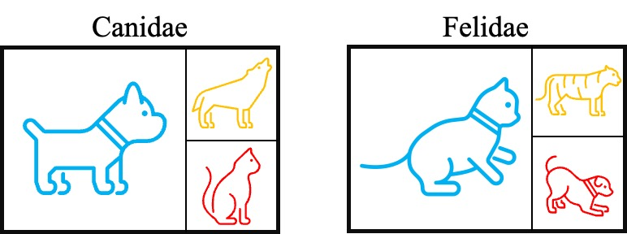

# LNL-IS
This is the code for our submisssion "Learning with Noisy Labels over Imbalanced Subpopulations"

# To obtain the results in our paper, run

    python3 train_waterbirds.py --pretrain --labelconf lv --warm_up 5 --r ** --subpopulation 95 --knn ** --unshifted_val --top **
or
    python3 train_celebA.py --labelconf lv --r ** --top **

# Requirement

    python==3.6.8
    scikit-learn==0.23.2
    torch==1.7.0+cu101
